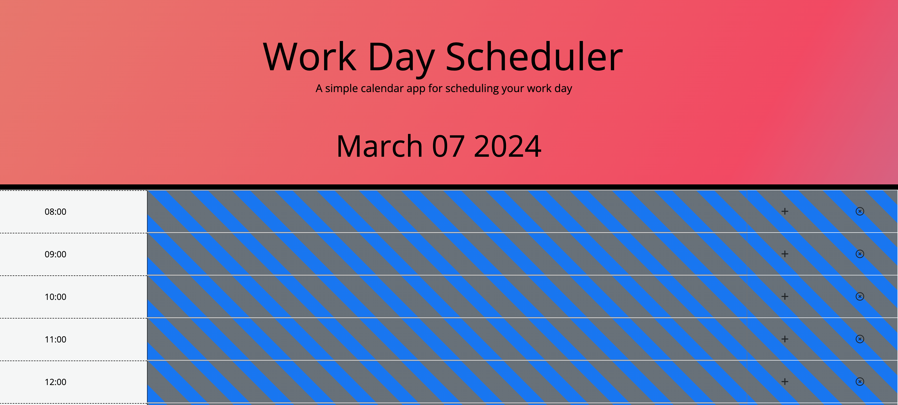
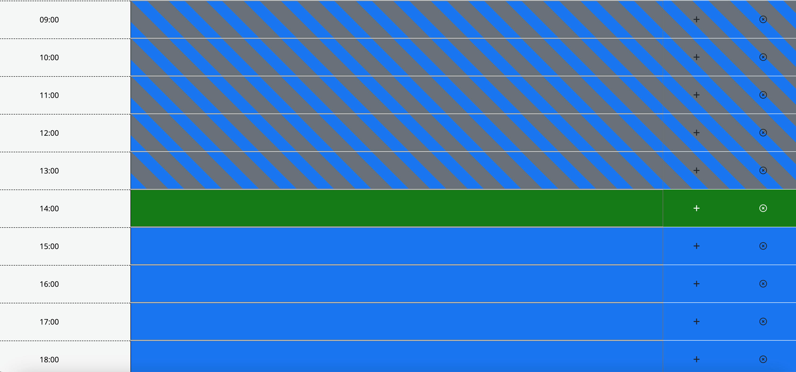
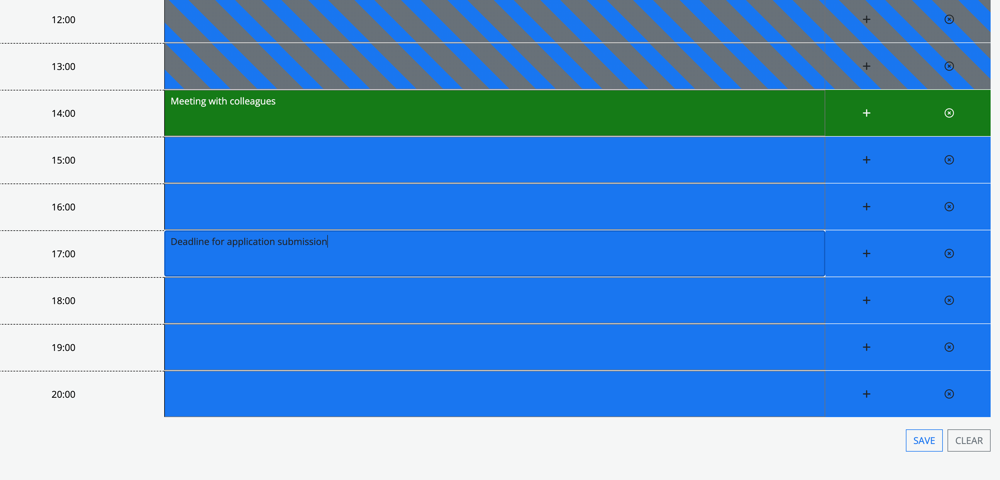

# Work Day Planner

## Description
A Planner for Your Working Day - a simple planner which saves events for hours and days. Implements learning on JQuery and APIs. 
Create a simple calendar application that allows a user to save events for each hour of the day by modifying starter code. This app will run in the browser and feature dynamically updated HTML and CSS powered by jQuery.

## Links
Respository Link
https://github.com/thelukass88/work-day-planner  
Live Page Link
https://thelukass88.github.io/work-day-planner/ 
## Images

## Table of Contents
* [Installation](#installation)
* [Useage](#useage)
* [Licence](#licence)
* [Contributions](#contributors)
* [Testing](#tests)
* [Questions](#questions)
## Installation
You'll need to use the [Day.js](https://day.js.org/docs/en/display/format) library to work with date and time. 
## Useage
Planning events for upcoming days. Saving details and checking against time. This is a resubmission on the EDEX Front End Dev course. The application has been improved from initial submission.
## Licence
Your application is licenced under: MIT
## Contributions
N/A
## Tests
N/A
## Questions
If you would like to contact me 
visit: [github/thelukass88](https://github.com/thelukass88) 
email: l.holliday88@hotmail.com

## Licence

MIT Licence