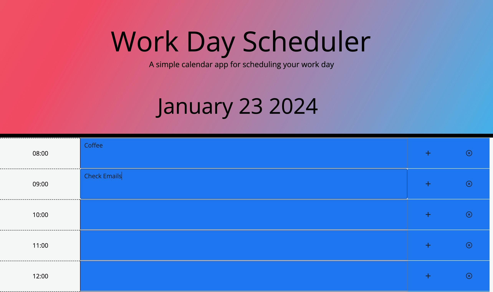
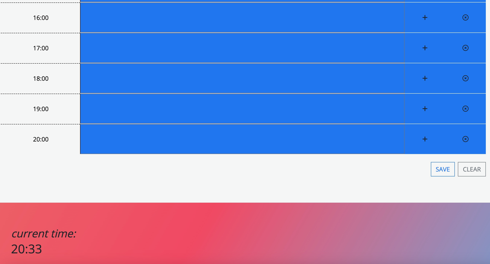

# work-day-planner
A Planner for Your Working Day - a simple planner which saves events for hours and days
# Third-Party APIs: Work Day Scheduler

## Task

Create a simple calendar application that allows a user to save events for each hour of the day by modifying starter code. This app will run in the browser and feature dynamically updated HTML and CSS powered by jQuery.

You'll need to use the [Day.js](https://day.js.org/docs/en/display/format) library to work with date and time. Be sure to read the documentation carefully and concentrate on using Day.js in the browser.

## User Story

```md
AS AN employee with a busy schedule
I WANT to add important events to a daily planner
SO THAT I can manage my time effectively
```

## Acceptance Criteria

The app should:

* Display the current day at the top of the calender when a user opens the planner.
- see screenshot one - also put current time at the bottom of the page
* Present timeblocks for standard business hours when the user scrolls down.
- succeeded
* Color-code each timeblock based on past, present, and future when the timeblock is viewed.
- see screenshot - currently blue as out of hours - switches to green 
* Allow a user to enter an event when they click a timeblock
- see screenshot 1 - can type in timeblocks
* Save the event in local storage when the save button is clicked in that timeblock.
- data is saved in local storage and linked to object for particular time
* Persist events between refreshes of a page
- could not manage to do this - whilst data is stored in local storage it clears with the refresh

## Screenshots



## Licence

MIT Licence